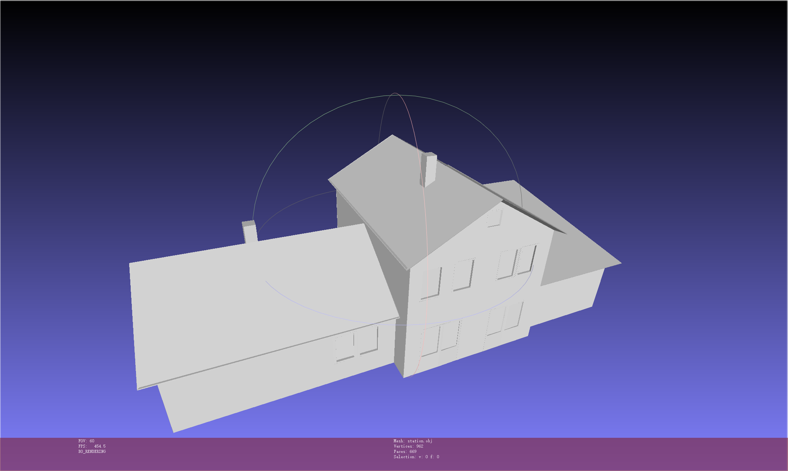
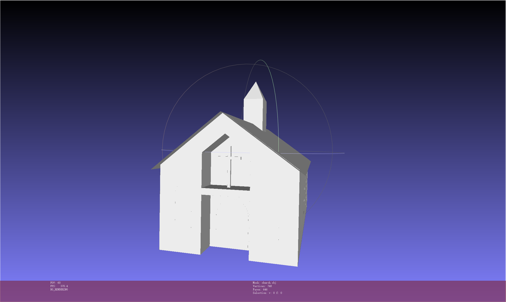
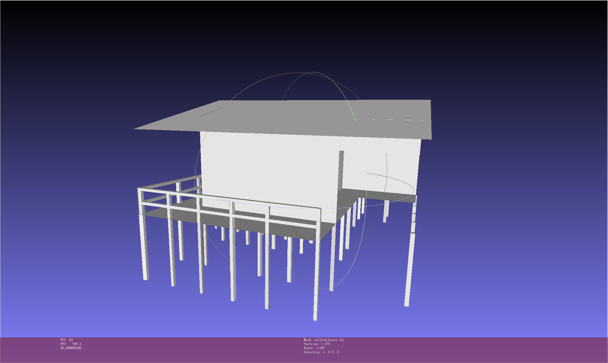

# Introduction

The homework is about **triangulating the faces of a polyhedron**. The steps taken include:

- read .hw file which contains vertice information and face vertices
- compute best-fitting plane for each face
- create a constrained triangulation containing all of its the edges as constraints projected to 2D using the best-fitting plane for each face
- for each face, label its triangulation using the *odd-even* rule
- extract interior triangulation and store them to obj file


# How to run?

## Requirements

- C++ and [CGAL library](https://www.cgal.org/)

- WSL toolchanis

## Input and output

Change the two lines according to the hw1 file and your desired output name.

```c++
const std::string input_file = "../stilted_house.hw1";
const std::string output_file = "../stilted_house.obj";
```

## Run

With WSL toolchains, run in release or debug mode.

## Results



Figure 1. Station.obj




Figure 2. church.obj




Figure 3. stilted_house.obj